# genart
Generative art

Most art generators are written in Python. No any 3D or special libraries, only
formulas of analytic geometry and drawing using pixels, rectangles, ellipsis, etc
on PNG surface using [PILLOW (PIL fork)](https://pypi.org/project/pillow/) .

## Example of art (see art/ folder):

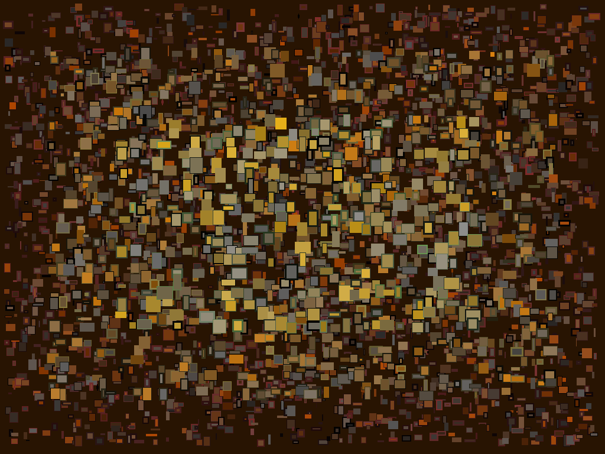

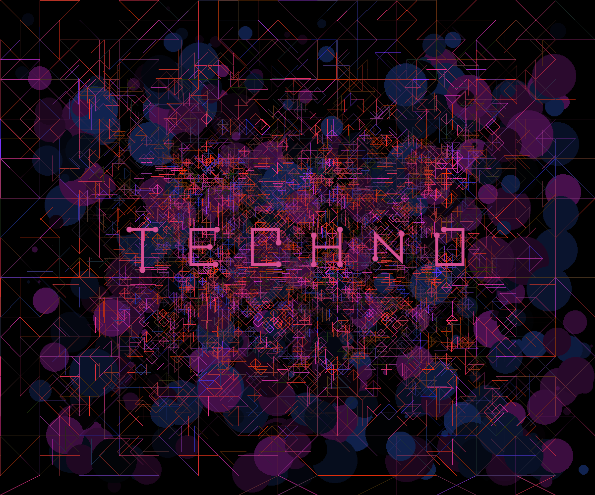

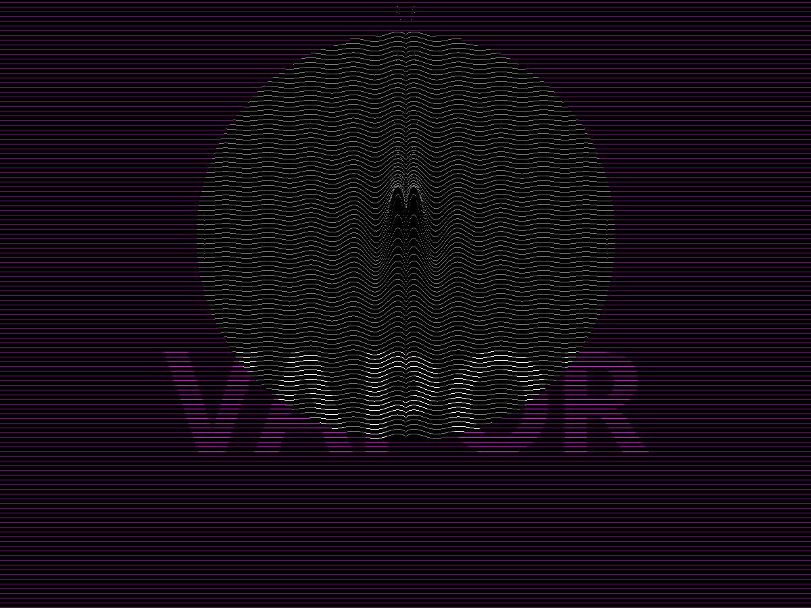

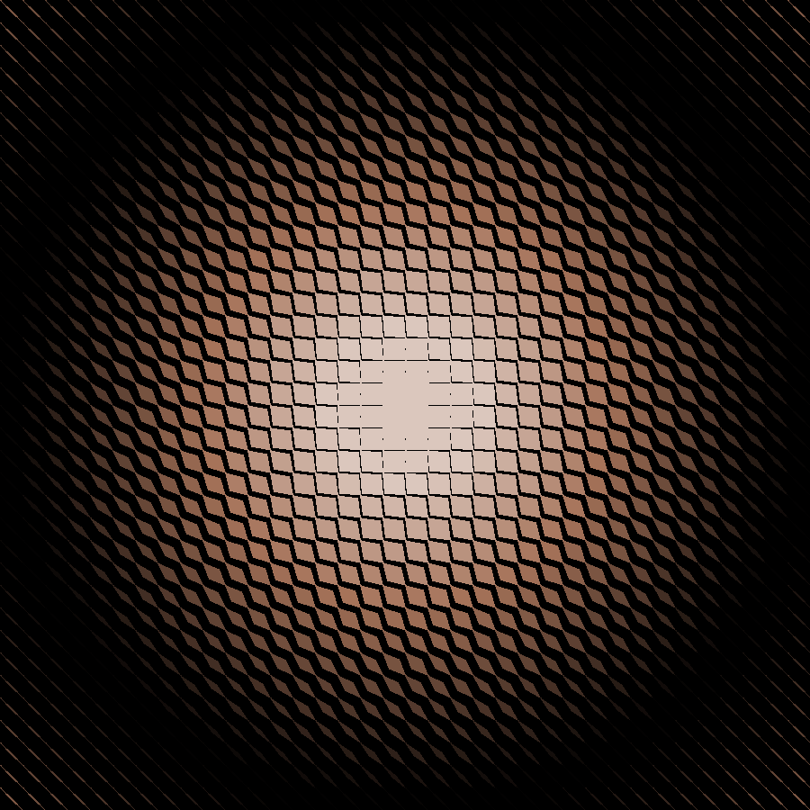

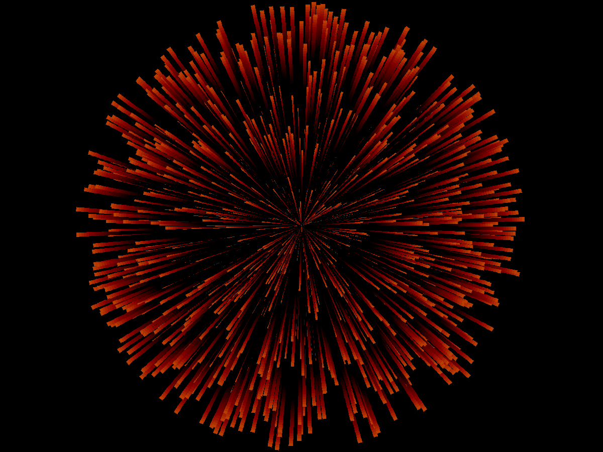

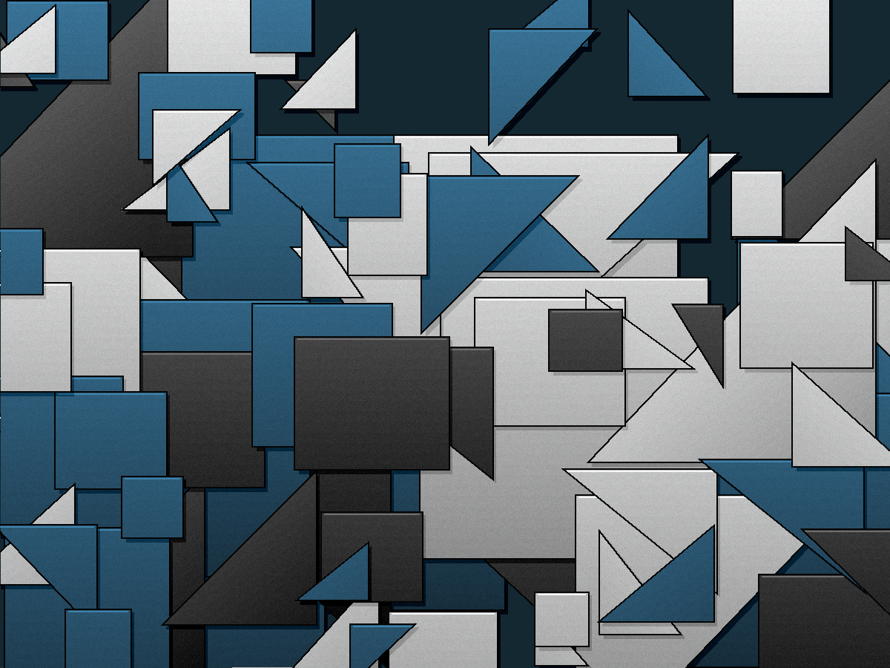

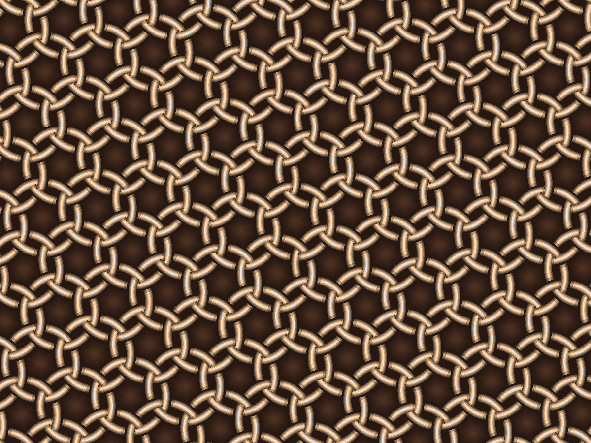

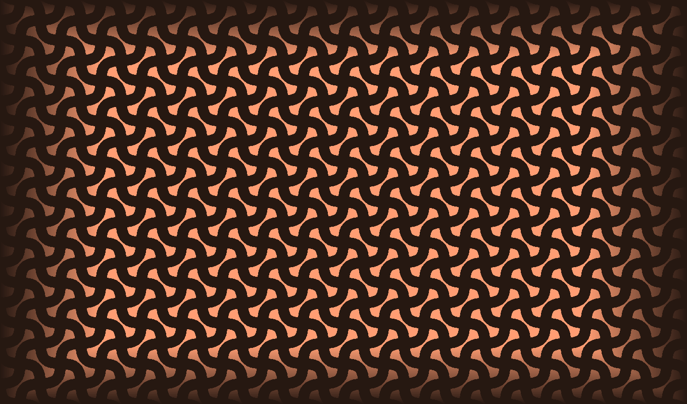

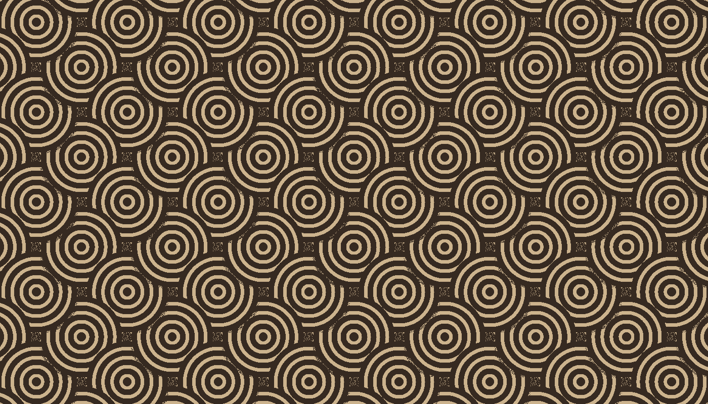

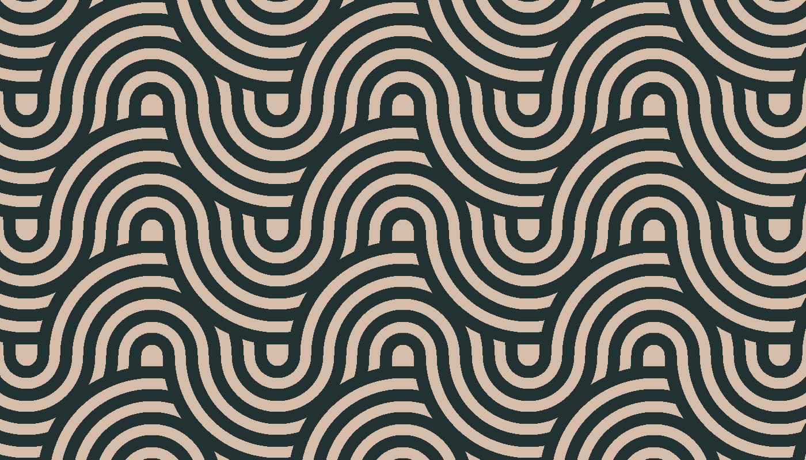

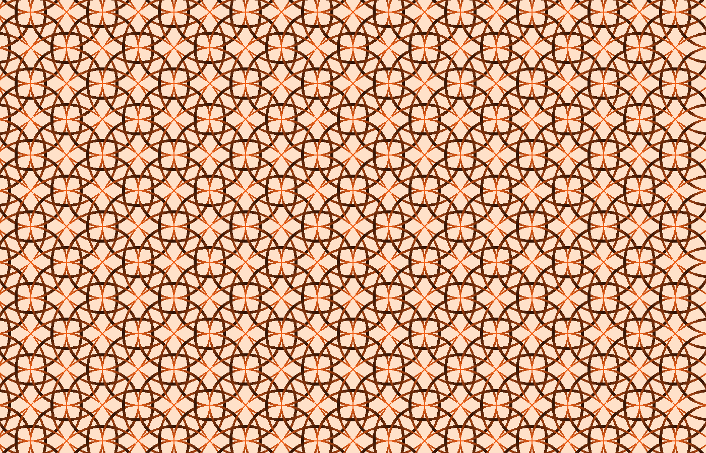

